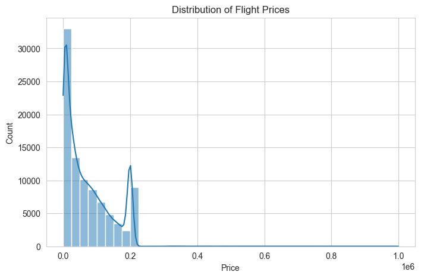
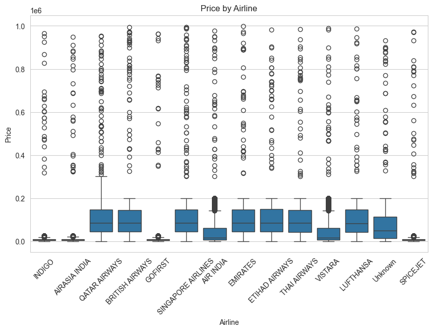
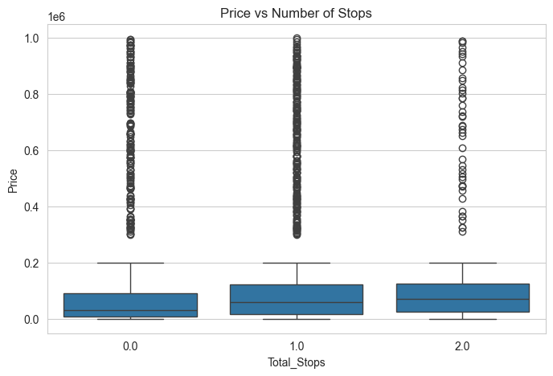
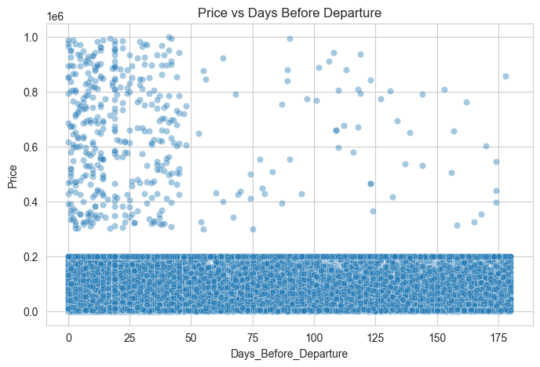
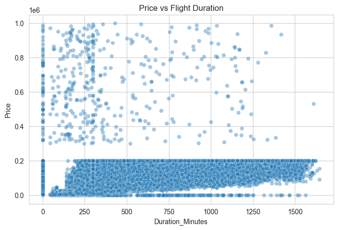
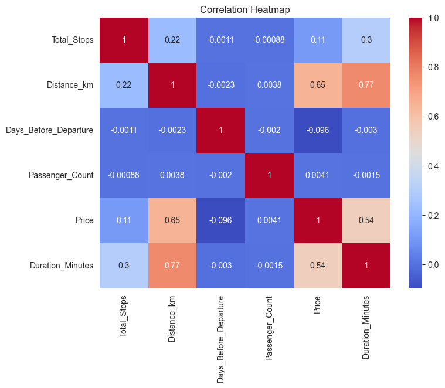

# ✈️ AI Travel Analyst
🔗 **[View live dashboard](https://akshayas2009.github.io/ai-travel-analyst/dashboard.html)**

## Project Overview
A data-driven analysis of flight pricing data, built to uncover the key factors that drive airfare costs and help travelers make smarter booking decisions. Includes an interactive Streamlit dashboard for exploring the data.

## Problem Statement
Flight prices vary widely and unpredictably, making it hard for travelers to know what drives costs or when/how to book smarter. This project cleans a messy real-world-style flight pricing dataset and analyzes it to answer: what actually determines flight price?

## Installation Instructions
```bash
git clone https://github.com/Akshayas2009/ai-travel-analyst.git
cd ai-travel-analyst
python3 -m venv venv
source venv/bin/activate
pip install -r requirements.txt
streamlit run app.py
```

## Dataset Used
`flight_pricing_dataset.csv` — 100,000 rows, 18 columns, provided for the MIC AIML Recruitment Challenge (Data Science & Visualization track). Contains flight details including airline, route, timing, stops, duration, and price, with intentionally messy formatting (mixed units, inconsistent city naming, missing values) as part of the challenge.

## Methodology
1. **Data cleaning:** Standardized inconsistent formats across nearly every column — stop counts (`"non-stop"` vs `"0"` vs `"1 stop"`), duration (decimal hours vs `"3h 11m"` format), time (12-hour vs 24-hour), and city names (airport codes, "City Airport" suffixes, case variants for airlines).
2. **Missing value handling:** Dropped rows missing the target variable (`Price`); filled missing categorical values with `"Unknown"` and missing numeric values with the column median.
3. **Exploratory analysis:** Built 6 visualizations examining price distribution, and price relationships with airline, stops, days-before-departure, duration, and inter-feature correlations.
4. **Insight extraction:** Computed group-by statistics and correlation coefficients to quantify (not just visualize) each factor's relationship with price.

## Technologies Used
- Python, pandas, numpy
- matplotlib, seaborn (visualizations)
- Streamlit (interactive dashboard)
- Jupyter Notebook (exploration)

## Results
- **Distance (0.65 correlation)** and **duration (0.54)** are the strongest price drivers.
- Clear ~10x price gap between budget and full-service international airlines.
- Number of stops and booking lead time have only weak effects on price.
- Passenger count has no meaningful relationship with price.

(Full details in the Key Insights section of the notebook/dashboard.)

## Challenges Faced
- The dataset had highly inconsistent formatting across nearly every column (e.g., `Total_Stops` had values like `"0"`, `"non-stop"`, `"1 stop"`, and `"1"` all meaning the same thing), requiring custom parsing functions rather than simple type conversion.
- City names appeared as IATA codes, full names, and "X Airport" variants simultaneously, requiring a manual mapping dictionary.
- Balancing missing-value handling: dropping rows was only appropriate for the target column (`Price`); other columns were imputed to avoid losing ~40% of the dataset.

## Future Improvements
- Add feature engineering and a price prediction model (Part 2 scope)
- Expand city/airline mapping to handle additional format variants
- Add outlier detection for suspiciously low/high fares
- Deploy the dashboard publicly via Streamlit Cloud

## Screenshots
## Screenshots





